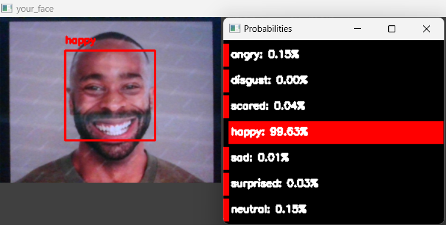
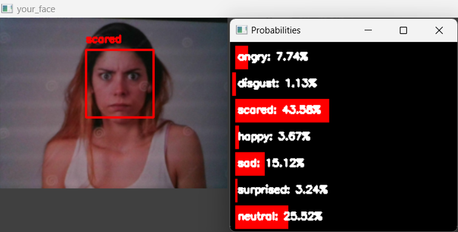

# Real-time Facial Emotion Recognition using CNN

Emotion understanding involves detecting cues, inferring emotion categories, and attributing causes. Comprehending a person's emotional states is computationally complex, requiring the flexible and context-sensitive deployment of cognitive processes to recognize emotionally salient cues rapidly.

The Xception model, implemented using TensorFlow, leverages depthwise separable convolutions and residual connections to create a lightweight yet powerful CNN architecture for facial emotion recognition. Trained on the FER-2013 dataset, which includes seven emotion classes (happy, sad, neutral, surprised, scared, disgusted, and angry), over 100 epochs, using the categorical cross-entropy loss function, the model achieved state-of-the-art results with a 92% accuracy. Its ability to efficiently learn and generalize from facial expressions makes it ideal for real-time applications.

